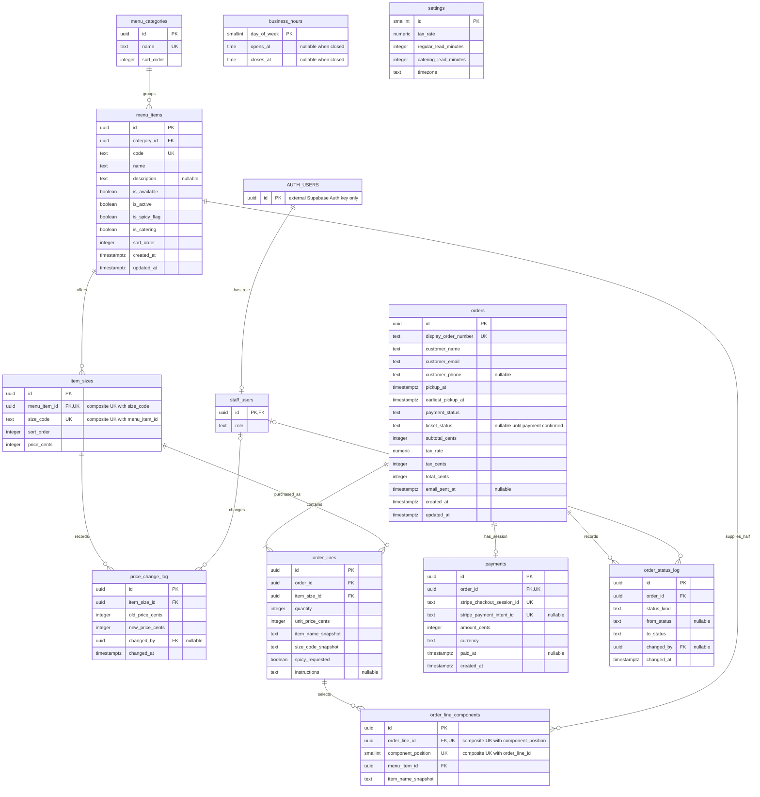

# Mermaid ERD — W2 support (T14/T15)

Prepared by Perry for Charles, 7 Oct 2026. **Proposed model, pending the 12 Oct approval gate. No migrations.** The column dictionary, nullability, constraints, unresolved decisions, and source references are in [tables-overview.md](tables-overview.md).

Mermaid lists all columns from the dictionary. `PK`, `FK`, and `UK` mark keys; comments identify nullable attributes. `numeric` denotes PostgreSQL `numeric(7,6)` here. `AUTH_USERS` is the existing Supabase `auth.users` entity, shown only to make the external FK explicit; it is not an application table to create.

## Cardinality and lifecycle notes for Visio

- Each menu item belongs to exactly one category; categories can be empty. Each size belongs to one item; an orderable item must have at least one size, although an item under setup can have none.
- A completed checkout record contains one or more lines; transactional creation must guarantee that minimum because an FK alone cannot. Each line references one size, which resolves its current item; snapshots preserve the historical label and price.
- Each G1 line has exactly two component rows, and every other line has none. Mermaid's zero-to-many edge cannot express that conditional exact count. Component positions are `1` and `2`, with one half per ordered parent unit, and the parent price includes both halves.
- Each order has zero or one payment association, and each payment belongs to exactly one order. Zero is necessary while a pending order exists before its Stripe session is saved. Session and order uniqueness support idempotent webhook handling.
- Each price/status event has zero or one staff actor, allowing system events. Each staff role record refers to exactly one external Auth user; an Auth user may have no application role.
- `business_hours` and singleton `settings` are intentionally separate and unconnected. Checkout uses their current values, then stores the order's applicable tax and earliest-pickup snapshots.
- Payment: `pending_payment → paid → refunded / cancelled` is the documented high-level lifecycle. Exact cancellation/refund transitions need agreement. Ticket: null until confirmed payment, then `received → in_progress → ready → completed`. An unpaid order never reaches the kitchen. A refund may retain historical ticket status.
- Keep item-level availability provisional, and obtain BR-08, BR-20, BR-23, BR-24, and BR-26 before approval. The dictionary records additional design choices requiring Charles's review and the F8/F16 change-log corrections.

The dictionary and diagram are the W2 handoff only. Charles redraws the official ERD in Visio; T23 database implementation follows approval.
